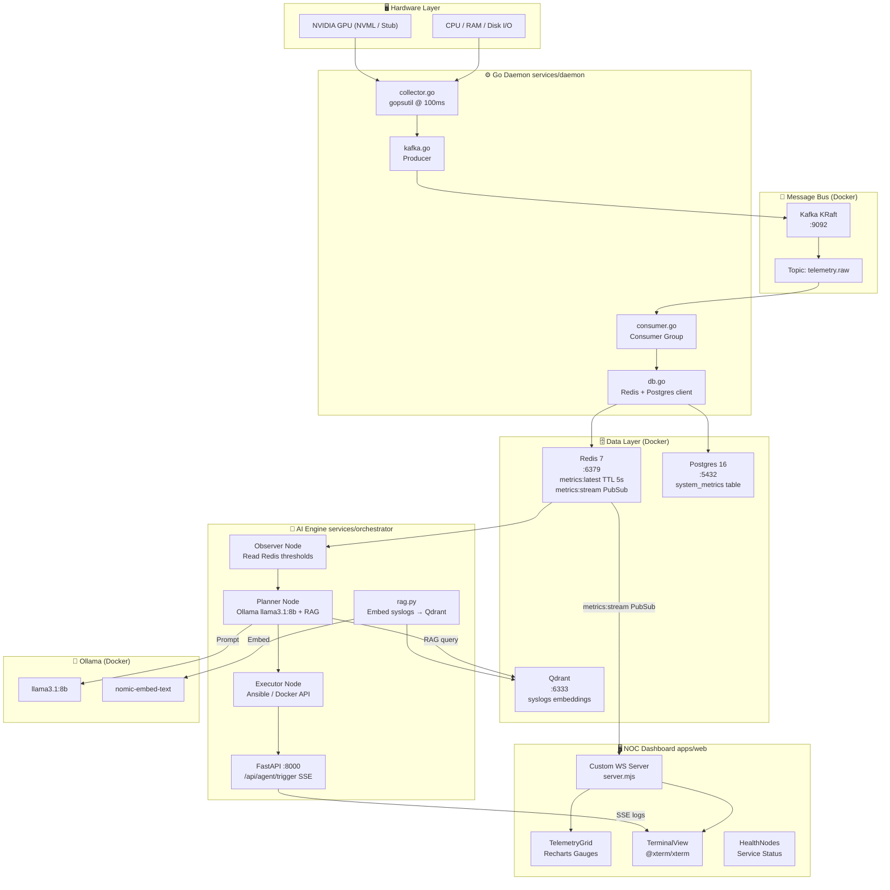
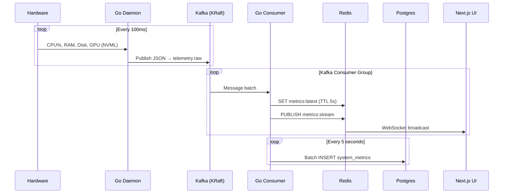
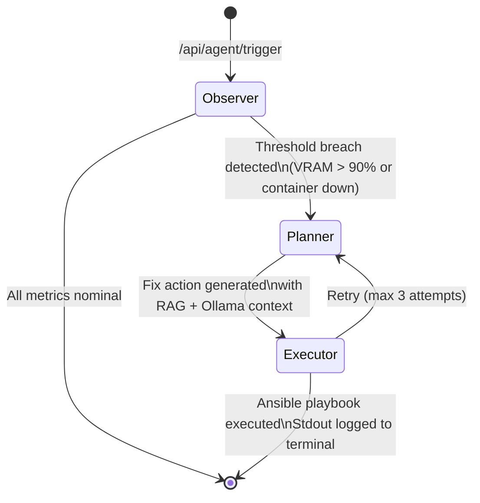
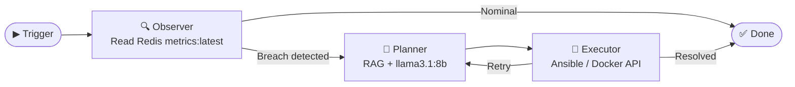
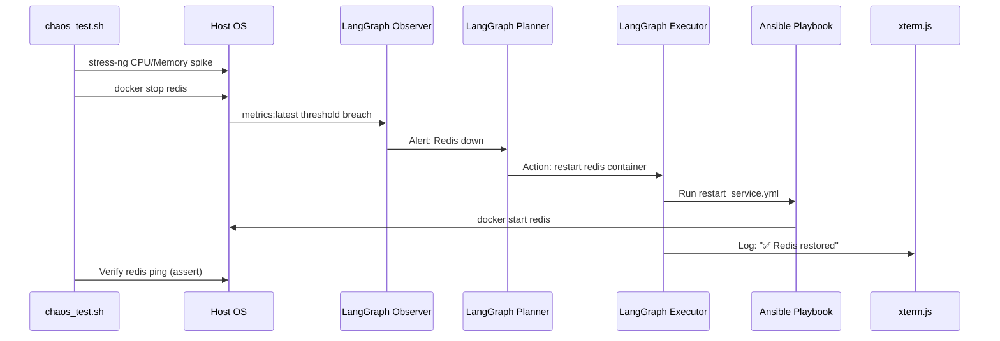

<div align="center">

# ⚡ AetherNet

**Air-Gapped Autonomous Telemetry & Self-Healing Local AI Workspace**

[](https://golang.org)
[](https://python.org)
[](https://nextjs.org)
[](https://kafka.apache.org)
[](LICENSE)

*A fully autonomous, offline-first platform that collects bare-metal hardware metrics at 100ms fidelity, streams them through a Kafka → Redis → Postgres pipeline, renders them in a cyber-ops dark-mode NOC dashboard, and closes the loop with a local LangGraph AI agent that reads anomalies and self-heals the infrastructure — no cloud required.*

</div>

---

## 📐 System Architecture



---

## 🔄 Telemetry Data Flow



---

## 🧠 AI Self-Healing Flow



---

## 🗂️ Monorepo Structure

```
aethernet/
├── apps/
│   └── web/                    # Next.js 16 NOC Dashboard
│       ├── src/
│       │   ├── app/
│       │   │   ├── page.tsx    # Main dashboard layout
│       │   │   ├── layout.tsx  # Dark-mode HTML shell
│       │   │   └── globals.css # Cyber-ops color palette
│       │   ├── components/
│       │   │   ├── telemetry-grid.tsx  # Recharts radial gauges
│       │   │   ├── terminal-view.tsx   # xterm.js + WebSocket
│       │   │   └── health-nodes.tsx    # Service health indicators
│       │   └── store/
│       │       └── telemetry.ts        # Zustand global state
│       └── server.mjs          # Custom WS + Next.js server
│
├── services/
│   ├── daemon/                 # Go bare-metal collector
│   │   ├── main.go             # Entrypoint
│   │   ├── collector.go        # gopsutil + NVML stub
│   │   ├── kafka.go            # Kafka producer
│   │   ├── consumer.go         # Kafka consumer → Redis/Postgres
│   │   ├── db.go               # Redis & Postgres client
│   │   └── go.mod
│   │
│   └── orchestrator/           # Python AI engine
│       ├── main.py             # FastAPI entrypoint
│       ├── rag.py              # Qdrant + nomic-embed-text
│       ├── agents.py           # LangGraph Observer→Planner→Executor
│       └── requirements.txt
│
├── infra/
│   ├── docker/
│   │   └── docker-compose.yml  # Kafka, Redis, Postgres, Qdrant, Ollama, Traefik
│   └── ansible/
│       └── playbooks/
│           ├── flush_vram.yml          # Restart Ollama + clear GPU cache
│           └── restart_service.yml    # Parametrized container self-heal
│
├── scripts/
│   ├── setup_monorepo.sh   # One-shot scaffold script
│   └── chaos_test.sh       # End-to-end chaos test
│
├── Makefile                # make up | make dev | make chaos
├── package.json            # pnpm workspace root
└── pnpm-workspace.yaml
```

---

## 🚀 Quick Start

### Prerequisites

| Tool | Version | Purpose |
|---|---|---|
| `pnpm` | ≥ 9 | Monorepo package manager |
| `go` | ≥ 1.22 | Go daemon |
| `python` | ≥ 3.12 | AI orchestrator |
| `docker` + `docker compose` | ≥ 24 | Infrastructure services |
| `ansible` | ≥ 8 | Self-healing playbooks |

### 1. Clone & Scaffold

```bash
git clone https://github.com/your-org/aethernet.git
cd aethernet
pnpm install
bash scripts/setup_monorepo.sh
```

### 2. Start Infrastructure

```bash
docker compose -f infra/docker/docker-compose.yml up -d
# Services started: Kafka (KRaft), Redis 7, Postgres 16, Qdrant, Ollama, Traefik
```

### 3. Pull Ollama Models (Required for Phase 4+)

```bash
docker exec -it ollama ollama pull llama3.1:8b
docker exec -it ollama ollama pull nomic-embed-text
```

### 4. Start the Go Daemon

```bash
cd services/daemon
go run .
# Output: Starting AetherNet Daemon...
```

### 5. Start the AI Orchestrator

```bash
cd services/orchestrator
pip install -r requirements.txt
uvicorn main:app --host 0.0.0.0 --port 8000
```

### 6. Start the NOC Dashboard

```bash
# From repo root:
pnpm dev:web
# Open: http://localhost:3000
```

### Or — use the Makefile

```bash
make up     # Start all infra (docker compose)
make dev    # Start daemon + orchestrator + web
make chaos  # Run end-to-end chaos tests
```

---

## 🖥️ NOC Dashboard

The dashboard is built with **Next.js 16 App Router**, **Tailwind CSS v4**, and renders live data from the Redis PubSub stream via a native WebSocket server.

### Color System

| Token | Hex | Usage |
|---|---|---|
| **Background** | `#020617` (Slate-950) | Page base |
| **Primary** | `#22d3ee` (Cyan-400) | Accents, cursor, borders |
| **Online** | `#10b981` (Emerald-500) | Service online indicators |
| **Warning** | `#f59e0b` (Amber-500) | VRAM / CPU alerts |
| **Danger** | `#ef4444` (Red-500) | Critical errors / service down |

### Components

| Component | File | Description |
|---|---|---|
| **Telemetry Grid** | `telemetry-grid.tsx` | Radial gauge cards for CPU, RAM, GPU, VRAM via Recharts |
| **Terminal View** | `terminal-view.tsx` | Embedded `@xterm/xterm` connected to live WebSocket stream |
| **Health Nodes** | `health-nodes.tsx` | Glowing service status indicators (Kafka, Postgres, Redis, Daemon) |

---

## ⚙️ Go Daemon

The daemon runs as a single binary and manages both the **producer** and **consumer** goroutines.

### Metrics Collected

| Metric | Source | Interval |
|---|---|---|
| CPU Usage (Overall & Per-Core) | `gopsutil/cpu` | 100ms |
| RAM (Total, Used, %) | `gopsutil/mem` | 100ms |
| Disk I/O (Read/Write bytes delta) | `gopsutil/disk` | 100ms |
| GPU Utilization, VRAM, Temp | NVML (stub fallback) | 100ms |

### Kafka Topic

| Topic | Format | Producer | Consumer |
|---|---|---|---|
| `telemetry.raw` | JSON (`TelemetryPayload`) | `collector.go` | `consumer.go` |

### Redis Keys

| Key | Type | TTL | Purpose |
|---|---|---|---|
| `metrics:latest` | String (JSON) | 5s | Latest snapshot for AI Observer |
| `metrics:stream` | PubSub Channel | — | Live stream to Next.js UI |

---

## 🧠 AI Orchestrator

The AI decision engine runs as a **FastAPI** server using **LangGraph** for stateful multi-agent coordination — all fully offline.

### LangGraph Agent Graph



### API Endpoints

| Endpoint | Method | Response | Description |
|---|---|---|---|
| `/api/agent/trigger` | `GET` | `text/event-stream` | SSE stream of LangGraph execution steps |
| `/health` | `GET` | `application/json` | Orchestrator health status |

---

## 🔥 Chaos Testing

The `scripts/chaos_test.sh` orchestrates an end-to-end test of the entire self-healing loop:



```bash
bash scripts/chaos_test.sh
```

---

## 🐳 Infrastructure Services

| Service | Image | Port | Purpose |
|---|---|---|---|
| **Kafka KRaft** | `bitnami/kafka:3.7.0` | `9092` | Message bus (no ZooKeeper) |
| **Redis 7** | `redis:7` | `6379` | Cache + PubSub stream |
| **Postgres 16** | `postgres:16` | `5432` | Long-term metrics storage |
| **Qdrant** | `qdrant/qdrant` | `6333` | Vector DB for RAG embeddings |
| **Ollama** | `ollama/ollama` | `11434` | Local LLM + embedding server |
| **Traefik** | `traefik:v3.0` | `80`, `8080` | Reverse proxy |

---

## 📦 Tech Stack

| Layer | Technology |
|---|---|
| **Frontend** | Next.js 16, TypeScript, Tailwind CSS v4, Zustand, Recharts, xterm.js |
| **Go Daemon** | Go 1.22, gopsutil v3, kafka-go, go-redis v9, lib/pq |
| **AI Engine** | Python 3.12, FastAPI, LangGraph, LangChain-Ollama, Qdrant Client |
| **Message Bus** | Apache Kafka (KRaft mode) |
| **Databases** | Redis 7, PostgreSQL 16, Qdrant |
| **Local AI** | Ollama (`llama3.1:8b`, `nomic-embed-text`) |
| **Infra** | Docker Compose, Ansible, Traefik |
| **Monorepo** | pnpm Workspaces |

---

## 🔐 Air-Gap Design

AetherNet is designed to run **100% offline**. No telemetry, no cloud calls, no external dependencies at runtime:

- ✅ All LLM inference runs through **local Ollama**
- ✅ All vector search runs through **local Qdrant**
- ✅ All message routing uses **local Kafka KRaft** (no ZooKeeper)
- ✅ All storage is **local Postgres + Redis**
- ✅ The UI uses a **custom WebSocket server** — no third-party real-time services

---

## 📄 License

This project is licensed under the MIT License. See [LICENSE](LICENSE) for details.

---

<div align="center">
  <sub>Built with ⚡ by the AetherNet team &nbsp;·&nbsp; Fully air-gapped. Fully autonomous.</sub>
</div>
