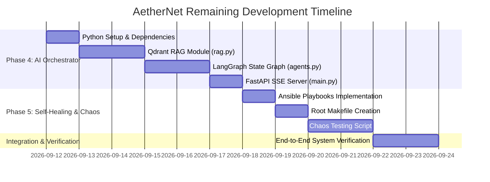

# ⚡ AetherNet Project Progress & Remaining Task Roadmap

**Document Created:** September 11, 2026  
**Target Architecture:** Air-Gapped Autonomous Telemetry & Self-Healing Local AI Workspace  
**Overall Completion:** ~60% (Phases 1–3 complete; Phases 4–5 pending)

---

## 📊 Executive Summary & Phase Status

| Phase | Description | Status | Completion |
|---|---|---|---|
| **Phase 1** | Monorepo Structure & Infra Setup (`pnpm`, `docker-compose`) | ✅ Completed | 100% |
| **Phase 2** | Hardware Metrics Ingestion Pipeline (`services/daemon` in Go) | ✅ Completed | 100% |
| **Phase 3** | Cyber-Ops NOC Control Center UI (`apps/web` Next.js 16) | 🟨 Substantially Complete | 95% |
| **Phase 4** | Offline AI Decision Engine (`services/orchestrator` Python/LangGraph) | ❌ Pending | 0% |
| **Phase 5** | Self-Healing Loop & End-to-End Chaos Tests (`ansible`, `Makefile`) | ❌ Pending | 0% |

---

## 🔍 Detailed Implementation Audit

### Phase 1: Monorepo & Infrastructure Setup
- [x] **Root Monorepo Setup:** `package.json` and `pnpm-workspace.yaml` configured.
- [x] **Directory Structure:** Scaffolding complete (`apps/web`, `services/daemon`, `services/orchestrator`, `infra/docker`, `infra/ansible`, `scripts`).
- [x] **Infrastructure Services (`infra/docker/docker-compose.yml`):**
  - Bitnami Kafka 3.7.0 (KRaft mode without ZooKeeper)
  - Redis 7 (Append-only storage & PubSub)
  - Postgres 16 (Relational database `aethernet`)
  - Qdrant Vector Engine
  - Ollama LLM server
  - Traefik v3.0 Reverse Proxy
- [x] **Setup Automation:** `scripts/setup_monorepo.sh` script created.

### Phase 2: Go Hardware Metrics Daemon (`services/daemon`)
- [x] **Hardware Metrics Collection (`collector.go`):**
  - CPU % total and per-core load via `gopsutil` at 100ms intervals.
  - RAM Total, Used, and Used % via `gopsutil`.
  - Disk Read/Write byte deltas.
  - NVIDIA NVML GPU utilization, VRAM used/total, and temperature stub interface fallback.
- [x] **Kafka Publishing (`kafka.go`):** Serialized JSON payload producer for topic `telemetry.raw`.
- [x] **Metrics Consumer (`consumer.go`):** Reads `telemetry.raw` with Kafka consumer group.
- [x] **Database Integration (`db.go`):**
  - Writes snapshot to Redis key `metrics:latest` with 5s TTL.
  - Publishes real-time metrics to Redis PubSub channel `metrics:stream`.
  - Auto-initializes Postgres `system_metrics` schema and batch inserts payloads every 5s.
- [x] **Compilation:** Go daemon compiles cleanly into binary `aethernet-daemon`.

### Phase 3: NOC Control Center UI (`apps/web`)
- [x] **Design & Theme System (`globals.css`, `layout.tsx`):** Slate-950 base, Cyan-400 accents, Emerald-500 status indicators, Amber/Red alert states.
- [x] **Telemetry Grid (`src/components/telemetry-grid.tsx`):** Radial gauge components powered by Recharts for CPU, RAM, GPU, and VRAM metrics.
- [x] **Terminal View (`src/components/terminal-view.tsx`):** `@xterm/xterm` with `@xterm/addon-fit` integration, auto-resizing, customizable color themes, and WebSocket listener.
- [x] **Custom WebSocket Server (`server.mjs`):** Node HTTP + WebSocket server subscribing to Redis PubSub `metrics:stream` and streaming to web clients.
- [x] **Health Nodes (`src/components/health-nodes.tsx`):** Visual indicators for Kafka, Postgres, Redis, and Daemon.
- [x] **State Management (`src/store/telemetry.ts`):** Zustand store for metrics, health states, and log buffers.
- [ ] **Minor Gap / Polish:** Connect SSE stream endpoint from Orchestrator (`/api/agent/trigger`) directly into the Terminal log stream; dynamic pinging for `health-nodes.tsx`.

### Phase 4: Offline AI Decision Engine (`services/orchestrator`) [PENDING]
- [ ] **RAG Module (`services/orchestrator/rag.py`):**
  - Connect to local Qdrant instance.
  - Ingest log sources (e.g. `/var/log/syslog` or mock fault logs).
  - Generate vector embeddings locally via Ollama (`nomic-embed-text`).
  - Upsert log embeddings into Qdrant index.
- [ ] **LangGraph Agent Workflow (`services/orchestrator/agents.py`):**
  - **Observer Node:** Reads `metrics:latest` snapshot from Redis, evaluates thresholds (e.g. CPU > 90%, VRAM > 90%, or service down).
  - **Planner Node:** Queries local Ollama (`llama3.1:8b`) with RAG log context to analyze root cause and formulate remediation action.
  - **Executor Node:** Dispatches Ansible playbook or Docker API command to resolve issue and captures execution output.
- [ ] **FastAPI Application (`services/orchestrator/main.py`):**
  - `/api/agent/trigger` endpoint returning `text/event-stream` (SSE) of execution steps.
  - `/health` diagnostic endpoint.
- [ ] **Python Dependencies (`services/orchestrator/requirements.txt`):** `fastapi`, `uvicorn`, `langgraph`, `langchain-ollama`, `qdrant-client`, `redis`, `pydantic`.

### Phase 5: Self-Healing Loop & Chaos Automation [PENDING]
- [ ] **Ansible Playbooks (`infra/ansible/playbooks/`):**
  - `flush_vram.yml`: Restart Ollama service / clear GPU VRAM allocation.
  - `restart_service.yml`: Parametrized self-healing script for container restarts.
- [ ] **Chaos Testing Harness (`scripts/chaos_test.sh`):**
  - Simulates CPU/RAM spike (`stress-ng`).
  - Simulates service failure (`docker stop redis`).
  - Asserts LangGraph Observer detection, Planner synthesis, Executor execution, and xterm logging.
- [ ] **Root Build Automation (`Makefile`):**
  - `make up`: Docker compose infra launch.
  - `make dev`: Concurrent execution of Go daemon, Python orchestrator, and Next.js web server.
  - `make chaos`: Execution of `chaos_test.sh`.
  - `make build` / `make clean`: Build binaries and clean temporary artifacts.

---

## 🗓️ Remaining Roadmap & Estimated Timeline

### Milestone Schedule

| Milestone | Deliverables | Target Timeline |
|---|---|---|
| **Sprint 1: Orchestrator Foundation** | `requirements.txt`, `main.py`, `rag.py` with Qdrant vector storage and Ollama `nomic-embed-text` integration | Day 1–3 |
| **Sprint 2: LangGraph Agent Loop** | `agents.py` with Observer, Planner (`llama3.1:8b`), Executor nodes, and `/api/agent/trigger` SSE stream | Day 4–5 |
| **Sprint 3: Ansible & Automation** | `infra/ansible/playbooks/flush_vram.yml`, `restart_service.yml`, and root `Makefile` | Day 6–7 |
| **Sprint 4: Chaos Harness & Validation** | `scripts/chaos_test.sh`, UI SSE integration in `terminal-view.tsx`, and full stack verification | Day 8–9 |

---

## 🎯 Next Immediate Action Steps

1. Create `services/orchestrator/requirements.txt` and install Python virtual environment dependencies.
2. Implement `services/orchestrator/rag.py` to index logs into Qdrant with local embeddings.
3. Implement `services/orchestrator/agents.py` using LangGraph.
4. Implement `services/orchestrator/main.py` with FastAPI & SSE streaming.
5. Create Ansible playbooks in `infra/ansible/playbooks/`.
6. Write root `Makefile` and `scripts/chaos_test.sh`.
